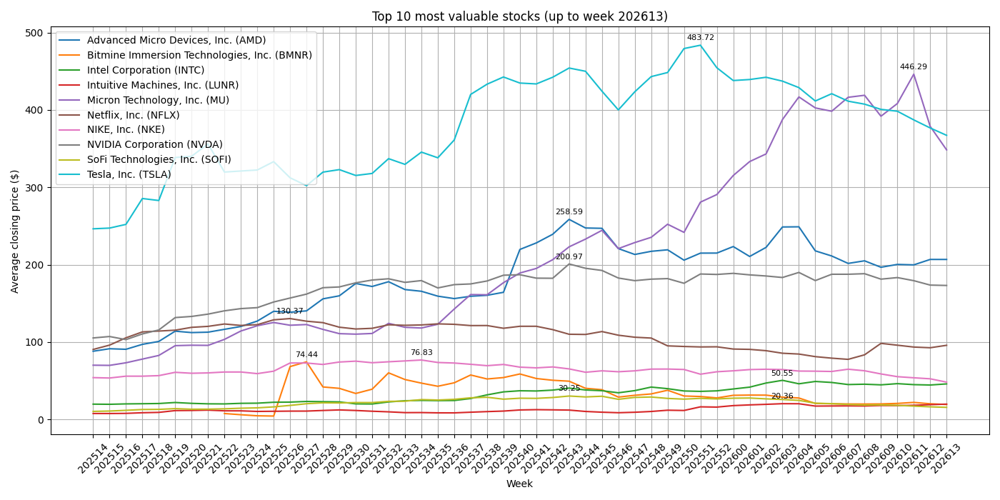

# 📈 Stock Market ETL (Automatizado con GitHub Actions)

Este proyecto realiza una extracción, transformación y visualización semanal de las acciones más activas en el mercado, usando Python, `yfinance` y `matplotlib`. El resultado se actualiza automáticamente cada semana mediante **GitHub Actions**.

---

## 🔁 Flujo del proyecto

1. 🧠 **Extracción**: se hace scraping de los tickers más activos desde Yahoo Finance
2. 📉 **Descarga**: precios históricos usando `yfinance`
3. 🧪 **Transformación**: cálculo de precios promedio por semana
4. 📊 **Visualización**: gráfico de las 10 acciones más valiosas de la semana
5. 🔄 **Automatización**: ejecución semanal con GitHub Actions

---

## 🗂️ Estructura

```
📁 images/
   └── top10_graph.png       ← gráfico generado semanalmente
📄 main_stock_etl_clean.py   ← script principal ETL
📄 requirements.txt          ← dependencias
📄 .github/workflows/        ← automatización con Actions
```

---

## 🛠️ Tecnologías utilizadas

- Python 3.10
- `yfinance`, `pandas`, `matplotlib`, `beautifulsoup4`
- GitHub Actions
- Git y GitHub (para control de versiones y CI/CD)

---

## 🕒 Automatización semanal

[](https://github.com/galo-coder/stock-market-etl/actions)

Cada lunes a las 7am (Lima 🇵🇪), el flujo se ejecuta automáticamente para:
- Descargar nuevos datos
- Regenerar el gráfico
- Hacer commit del gráfico al repositorio

---

## 📊 Último gráfico generado



---

## 🧠 Autor

- 👤 Gonzalo Rivera – [galo-coder](https://github.com/galo-coder)
- 💼 Ingeniero de Datos | Especialista en Azure, ETL, Visualización y Automatización

---
